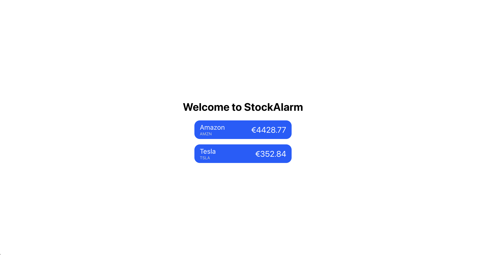
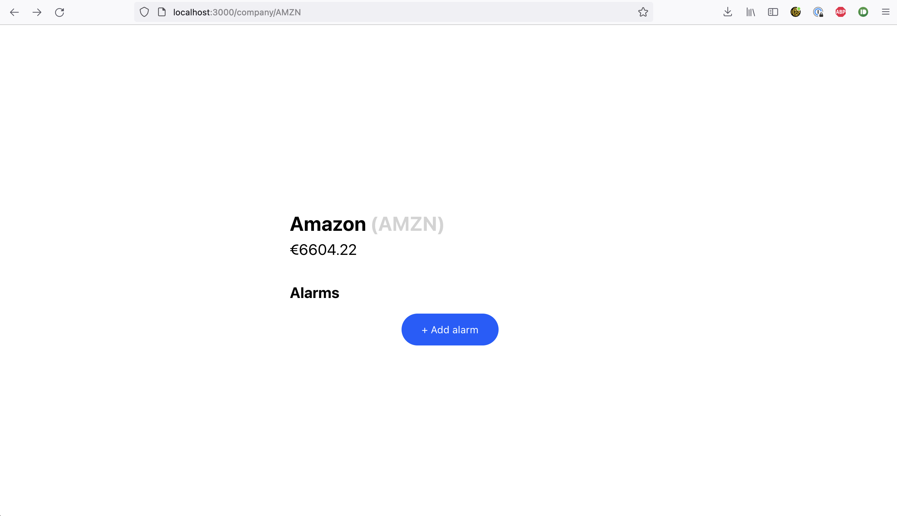
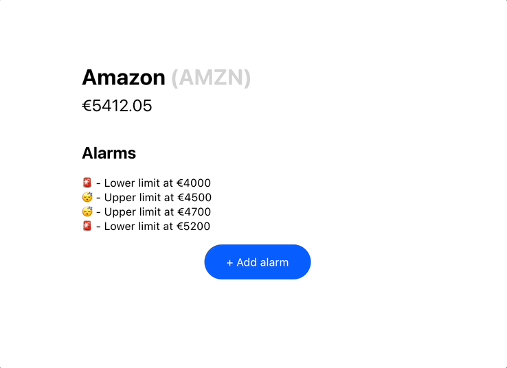

# Getting started

## Prerequisites

* Node.js

## Setup

1. Install Firebase CLI tool ([See guide here](https://firebase.google.com/docs/cli#install_the_firebase_cli))
2. `firebase login` -> login with the email address we've been using to have contact
3. `firebase projects:list` -> check if `exercise-<yourname>` is present. If not, contact us!
4. `firebase use exercise-<yourname>`

## Running

`npm start`

You can immediatly start working in the frontend & backend. Both service reload whenever you make an edit.

# Tasks

Please create a commit for every exercise.

When you open the app you'll see an unstyled page showing two companies whose stock prices change every 5 seconds. You can find the [database here](http://localhost:4000/database/exercise-foobar-default-rtdb/data) (once the emulator is running).

We want you to do three things:

1. Style the page
2. Create it so that you can navigate to a company's page
3. Allow user to set alarms which are triggered

## Exercise 1 - Style the page

We want you to make the page look like this:

* Background: #000000
* Gray: #d3d3d3
* Blue: #0a5dff
* Border radius: `16px`
* Font sizes:
    * Company name: `20px`
    * Company ticker: `12px`
    * Stock price: `24px`
* Margins between header and companies: `16px`
* Padding in company item: `8px` on y-axis and `16px` on x-axis.

## Exercise 2 - Navigate to a company's page

When a user clicks on of the companies they should be navigated to a page specifically for the company. It should look like this:

* Width of elements container `512px`
* Margin between title and price: `8px`
* Margin between price and 'Alarms': `40px`
* Button padding: `16px` on y-axis and `32px` on x-axis
* Button border radius: `32px`

## Exercise 3 - Allow users to set alarms

Allow users to set either an upper limit or lower limit alarm and visually show whether it's active. It should look like this:

You should implement the trigger alarm logic in the **backend** in `functions/src/checkAlarms.ts`.

## Notes

* Don't worry about users and authenticating. Just assume there is, and will ever be, just 1 user, which is you.
* There's a bug right now where during exercise 3 the reloading of the backend doesn't work. As in; changes in `checkAlarms` don't take effect. You're going to have to manually restart every time. I'm sorry.

# Submitting

Please create a **private** fork. Do **not** create a pull request to the original repository. Instead:

1. Invite your contact person to your private repository
2. Create a PR within your own repo. The base branch should be this repo. The new branch (name it whatever you like) should be your submitted code.
3. Add your contact person as a reviewer.